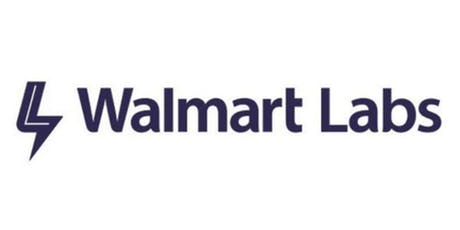
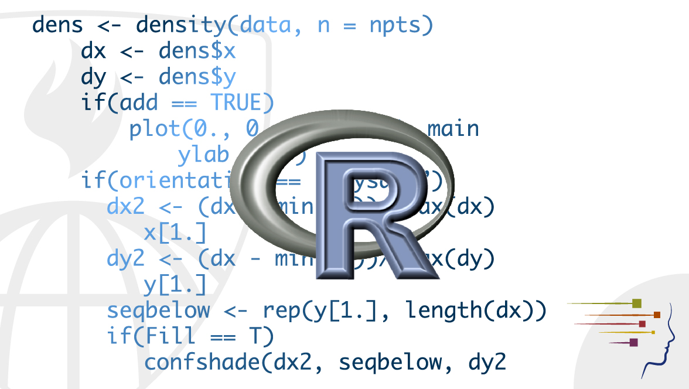
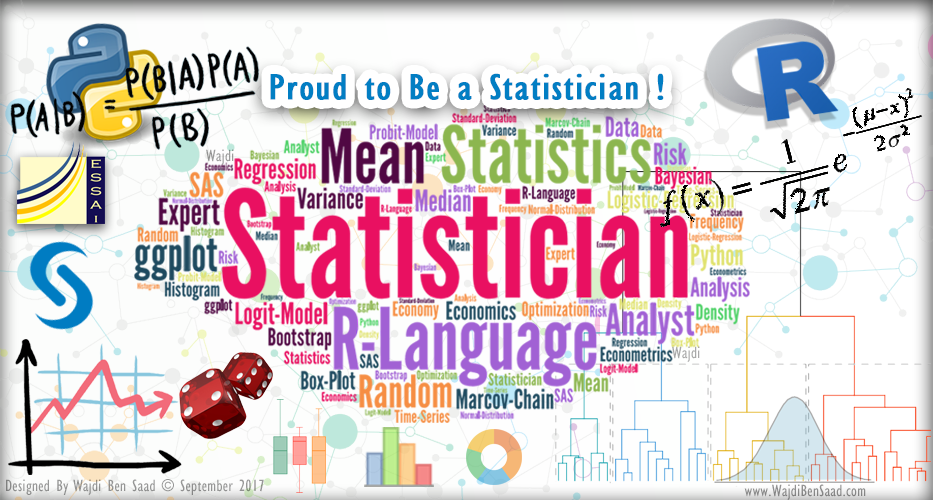

```{r setup, include=FALSE}
options(htmltools.dir.version = FALSE)
```

### Session 1.1 Outline

- Introductions

- Class goals

- Class materials, format and policies

---
background-image: url(pics/why_here.jpg)
background-size: cover
class: center, middle, inverse

# Why are we all here?

---
class: center, middle

# Why are we all here?

Hopefully for **X415.2 Introduction to Data Science**

---
### On the waitlist?

I cannot add you. Official policy is that you will be offered an open spot in the order you fall on the list, if spots are available.
  + We have a limited # of seats, which have to go to those who are enrolled.


---

### Why am I here?

.pull-left[
I have a background in data science and enjoy teaching.

- Mathematics (BA) and Statistics (MS, PhD)

- Data Scientist in the Bay Area since 2013 at

  + Verisk Analytics
  + GE Digital
  + Unitedhealthcare
  + WalmartLabs

- R user since 2007

- Have taught colleagues R, machine learning, and stats

Email: robert UNDERSCORE clements AT berkeley DOT edu
]

.pull-right[
<div style="width:200px; height=100px">
</div>
<div style="width:200px; height=100px">
</div>

]
---
### Why are you here?

1. To start your journey towards becoming a data scientist/analyst/engineer?

2. To better understand what is going on at your company?

3. To learn what all the fuss is about?

4. Some other reason?

---
class: inverse, center, middle

# Class Goals

---
class: inverse, center, middle

### By the end of this course I hope you have at least some understanding of how data science impacts your everyday life, and enough understanding of how it works so that you aren't afraid of it, confused by it, and can separate the hype from reality.

---
### Setting expectations

This course is **INTRODUCTORY**. 

.pull-left[
 
]
.pull-right[
 
]

---
### Setting expectations

This course is **R-HEAVY**.

.pull-left[
 
]
.pull-right[
 
]

---
### Setting expectations

- This is not a pure programming course
- This is not a machine learning course
- This is not a statistics course
- This is not a high-level theory course

Instead, we will be doing

- *Some* programming (we will use R every week)
- *Some* data analysis, data processing and data visualization
- *Some* statistics 
- Learning and **doing** some best practices

---

### In this course I hope to **introduce** you to

- fundamental data science concepts and tasks
    + data munging
    + data exploration
    + visualization
    + very short intro to predictive modeling

- the *typical* data science process
    + problem formulation
    + data gathering
    + reporting

- good data science practices
    + coding
    + documentation
    + reproducibility

---

### I hope to do this through

- the use of simple examples

- the use of the R programming language

  + yes, Python, Julia, SAS, Spark, and your favorite language are all good tools, too!! There's room for everybody. But in here, we are using R.

- hands-on exercises   

- weekly assignments

---

### What I won't be teaching you

- How to be a rockstar data scientist

- Model deployment \*\*\*

- Big data \*\*\*

- AI \*\*\*

- Enough to get a job as a data scientist

--

\*\*\**We may touch on some of these topics.*

---
class: inverse, center, middle

# Class Materials, Format and Policies
---

### Class Materials

You can access all class materials through Canvas

As we go through each week I will make available the

- readings,
- slides,
- and labs.

---
class: inverse, center, middle

### Demo Canvas

---
### Class Format

- Weekly lectures, discussions and activities for first two hours (in bite-sized chunks)
  + There may be multiple slide decks for each lecture (e.g. labeled Session_1.1, Session_1.2, etc.)

- Weekly labs (7 in total)
  + Some will be started in-class during last hour - bring your laptops
  + Due on Tuesday of the following week

- Weekly code review
  + Done in class

- Take home midterm (basically like a homework assignment)

- Final exam (take-home + in-class quiz) 


---
### Class Format

- Weekly lectures, discussions and activities for first two hours (in bite-sized chunks)
  + There may be multiple slide decks for each lecture (e.g. labeled Session_1.1, Session_1.2, etc.)

- Weekly labs (7 in total) **individual**
  + Some will be started in-class during last hour - bring your laptops
  + Due on Tuesday of the following week

- Weekly code review
  + Done in class **in groups**

- Take home midterm (basically like a homework assignment) **individual**

- Final exam (take-home + in-class) **individual**

---
### Other Class Policies

Collaborating:

Data science is rarely done alone. In the office, you will have others around that you will either be collaborating with directly, or using as resources to help you learn and grow. However, here are the guidelines you should use when working on your assignments:  

- Feel free to discuss lab problems with each other, but all code and writing must have been completed by you. Do NOT share code.  

- You can NOT work together on the midterm and final. Don't discuss the problems with each other. Direct any questions you have to me.  

- If you use code from online resources, please cite these in your work.

---
### Attendance and Grading

Attendance is expected and mandatory, but can be excused for illness/emergency. If you have any concerns, please see me.

Criterion 1 (Labs) – 30% (Lowest score will be dropped)  
Criterion 2 (Take home midterm) – 30%  
Criterion 3 (Take home final) -  30%  
Criterion 4 (Attendance and Participation) - 10%  

Final grades will be based on a curve. 

---
class: inverse, center, middle

# End of Session 1.1