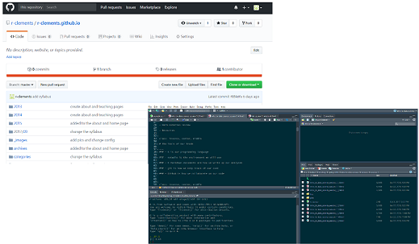
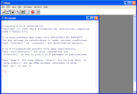
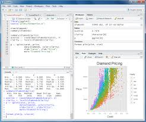
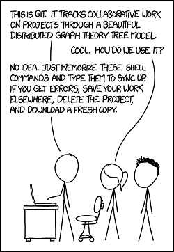

```{r setup, include=FALSE}
options(htmltools.dir.version = FALSE)
```

### Session 1.4 Outline

- The tools of our trade

- R, RStudio, Tidyverse

- Git and Github

- Resources

---
class: inverse, center, middle

# The Tools of Our Trade

---
### Our tech

- R is our programming language

- RStudio is the environment we will use

- R Markdown documents are how we write up our analyses

- git is how we keep track of our code

- Github is how we collaborate on our code

.center[]
---
class: inverse, center, middle

# R, RStudio and Tidyverse

---
### What is R?

- R used to be a **statistical programming language**, but has evolved into a much more versatile data science tool

- It was originally designed by academics, not data scientists

- It is free and open source

- It can do statistics, modeling, visualization, and dashboards by incorporating external "packages", most of which are also open source
  + The R package library contains > 10k packages, is constantly growing, and is the source of R's power


.center[]


---
class: center

### Fun Fact!

These slides were created with R!


---
### What is [RStudio](https://www.rstudio.com/)

- RStudio is a free and open source integrated development environment (IDE) for R
  + There are commercial versions available
- It's a workspace for your code, plots, files, console, etc.

.center[]

---
### Getting R and RStudio on your machine

Download R from here: [https://cran.rstudio.com/](https://cran.rstudio.com/)

Download RStudio from here: [https://www.rstudio.com/products/rstudio/download/#download](https://www.rstudio.com/products/rstudio/download/#download)

---
class: center, middle, inverse

# RStudio Demo

---
### Tidyverse

The tidyverse is a collection of R packages that we will use for this course. They were written mostly by [Hadley Wickham](https://twitter.com/hadleywickham), and make working with data in R a more painless process. More details here: [https://www.tidyverse.org/packages/](https://www.tidyverse.org/packages/)

Example packages:

- readr - loading data into R

- tidyr - functions for creating tidy data (i.e. every column is a variable)

- ggplot2 - visualization based on the Grammar of Graphics

- dplyr - easy data manipulation with verbs
---
### Installing the tidyverse packages

- Open RStudio

- In the console type:

```{r eval=FALSE, tidy=FALSE}
install.packages("tidyverse")
```

- Now, to load the core tidyverse packages into your R session, type:

```{r eval=FALSE, tidy=FALSE}
library(tidyverse)
```

---
class: center, middle, inverse

# Git and Github

---
### What is git?

.center[]

---
### What is git?

- Git is a *distributed* version control system (VCS)

  + A VCS keeps track of changes in your code 
  
  + VCS's are great for collaborating on code

  + some alternative VCS's are Subversion, CVS, and Mercurial

.center[]

---
### What is git?

- Git is a set of commands you use to keep track of code changes

  + Can be run from the command line
  
  + Can be run from a desktop app (downloaded from [here](https://desktop.github.com/))
  
  + Can be run directly from RStudio
  
  + Some things can be done directly in Github (we'll talk about Github in a sec)

---
### What are git repositories?

The repository (.git/) is where git puts the information related to your code changes. Since git is a *distributed* VCS, you can have both **local** and **remote** repositories.

- **local** - on your laptop. The .git directory is right there in your project folder.

- **remote** - on a server.

Advantages of this? You don't absolutely need a server to do version control, unlike with some other VCS's.

---
### The most important git commands

This is mostly what you'll need to know, but we'll be doing this from RStudio so you don't have to use the command line:
```yaml
git clone     # for cloning a repository in a new location, 
              # e.g. from Github onto your laptop  
git add       # for adding files to the staging area 
              # (getting them ready to be under version control)  
git commit    # for commiting changes to your 
              # files to the local repository  
git push      # for pushing changes to your remote repository  
git pull      # for pulling any changes from your 
              # remote repository to your local  
```
---
### What is Github?

- [Github](https://github.com/) is a web-based version control repository and hosting service

  + This is the place your code will be kept, and made available to others
  
  + Github has many amazing features, but we'll only scratch the surface

.center[]

---
### Getting git on your machine, and signing up for Github

Download git from here: [https://git-scm.com/downloads](https://git-scm.com/downloads) (if you have a mac, you may already have it)

Sign up for Github here: [https://github.com/](https://github.com/)

Consider this advice for naming your Github account: [http://happygitwithr.com/github-acct.html](http://happygitwithr.com/github-acct.html)
---
class: middle, center, inverse

# Git & Github Demo 

---
class: inverse, center, middle

#Resources

---
### Resources for learning git and Github

- [http://rogerdudler.github.io/git-guide/](http://rogerdudler.github.io/git-guide/) - *warning: some adult language*

- [Github Guides](https://guides.github.com/activities/hello-world/) - straight from the source

- [Git and R](http://happygitwithr.com/)

- [Git and RStudio demo](https://jennybc.github.io/2014-05-12-ubc/ubc-r/session03_git.html)

- For everything else, I google it and use Stack Overflow

---
### Resources for learning R and reading about data science

- [swirl R package](http://swirlstats.com/) - a package for step-by-step R tutorials.

- [RStudio Cloud](https://rstudio.cloud/) - use R from your browser. Contains cheatsheets and tutorials.

- [R-bloggers](https://www.r-bloggers.com/) - collects R blogs. Good for learning more about R in general. A good mix of beginner and advanced blogs.

- [Simply Statistics]( http://simplystatistics.org/) - Blog by Johns Hopkins professors.

- Many, many tutorials online. If you find one you like, please let me know so I can share it with others.

---
class: inverse, center, middle

# End of Session 1.4