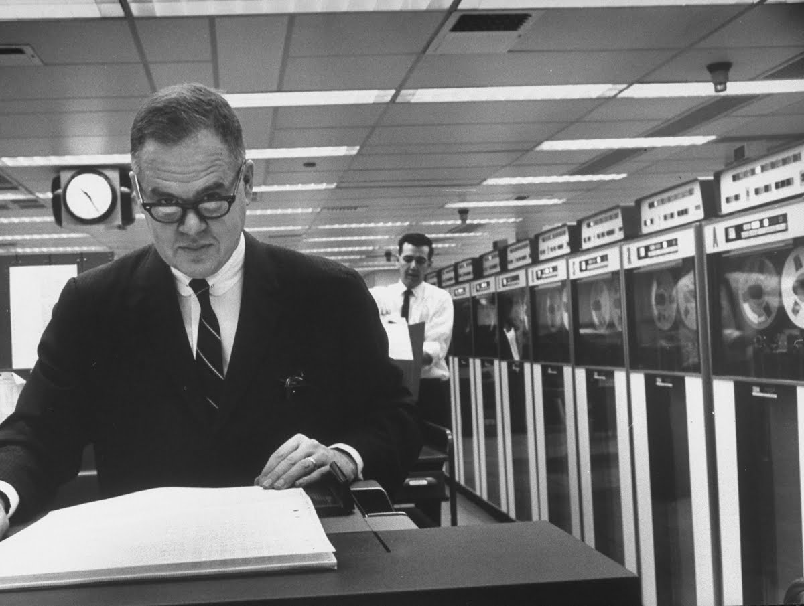
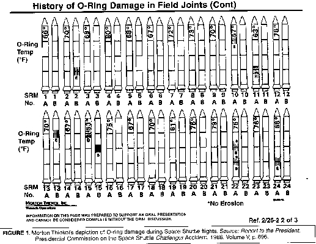
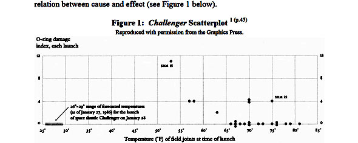

```{r setup, include=FALSE}
options(htmltools.dir.version = FALSE)
```

### Housekeeping

- The wait list: I cannot add you. Official policy is that you will be offered an open spot in the order you fall on the list, if spots are available.
  + If a spot doesn't open soon, think about joining the class the next time it is offered.
- RStudio, R and R package issues?
  + Don't worry about masked functions or conflicts yet.
  + RStudio Cloud is still an option for those who are frustrated.
- Excused absences: if you know ahead of time, just let me know. You're still responsible for turning in the assignments.
- The textbook: optional. Homework and exams will either be code- or lecture-based.
- Any other questions?

---
### Session 2.1 Outline

- Exploratory Data Analysis definition
- People in Visualization
- Software for Visualization
- Importance of Visualization

---
class: inverse, center, middle

# Exploratory Data Analysis

---
### EDA

The goal of EDA is to summarise and explain certain attributes of the data and was popularized by John Tukey. This can be done with numbers, tables, statistical models, and graphics (our focus for this session).

- Formulate hypotheses
- Check assumptions for models and statistical tests
- Data cleansing



---
class: center, inverse, middle

## "The simple graph has brought more information to the data analyst's mind than any other device." ~~Robert Clements~~ John Tukey

---
class: center, inverse, middle
# People
---
## People

### [Edward Tufte](https://www.edwardtufte.com/tufte/) - critic of powerpoint, evangelizer of sparklines and small multiples

### John Tukey - inventor of the boxplot!!

### [Flowing Data](http://flowingdata.com/) - blog by Nathan Yau

---
class: inverse, center, middle

# Software?

---
### Software

Obviously we will be using R, but even R has several options for visualization:

- Base R graphics (no packages required)

```{r, fig.align='center', fig.asp=.75}
data(cars)
plot(cars$speed, cars$dist)

```
---
### Software

Obviously we will be using R, but even R has several options for visualization:

- Lattice graphics

```{r, fig.align='center', fig.asp=.75}
data(cars)
lattice::xyplot(dist ~ speed, data = cars)
```

---
### Software

Obviously we will be using R, but even R has several options for visualization:

- ggplot2 graphics

```{r, message = FALSE, warning = FALSE, fig.align='center', fig.asp=.65}
library(ggplot2)
data(cars)
ggplot(cars, aes(x = speed, y = dist)) + geom_point()
```

---
## Others?

### A bunch more in R
### Python libraries
### D3 - interactive javascript-based
### Excel 
### Tableau/Spotfire
### What else??

---
class: inverse, center, middle
# Importance of Visualization

---
## Challenger disaster

Before the launch, Morton Thiokol and other engineers attempted to postpone the launch. They provided tables and charts, like the one below, as evidence that the O-Rings may fail. NASA wasn't convinced.


http://www.stat.ucla.edu/~vlew/stat10/archival/FA00/handouts/graph110.html
---
### Challenger disaster

Might graphics like this be more convincing?


http://visualjournalism.com/representation-and-misrepresentation-tufte-and-the-morton-thiokol-engineers-on-the-challenger/2011/03/23/

---
### When are graphics not important?

There are situations where simply showing the raw numbers is just as effective, or even moreso, than showing a graphic. Just make sure the tables are very clearly labeled.

- Univariate analyses
  + summary statistics
  + p-values
  + scores/metrics
- Structured numeric data in tables
- When the numbers are needed as a reference

Rule of thumb: if you need to visualize trends, relationships, or large amounts of data, then a graphic is usually better.

---
### Why do data scientists hate pie charts?

```{r, echo = FALSE, warning=FALSE, message=FALSE, fig.align='center', fig.width=10}
hmlss <- data.frame(substance = c('alcohol', 'cocaine', 'heroin'), homeless = c(.49, .28, .23), housed = c(.30, .38, .32))

hmlss_l <- tidyr::gather(hmlss, key = housing, value = value, homeless, housed)

ggplot(hmlss_l, aes(x="", y=value, fill=substance)) + 
  geom_bar(width = 1, stat = "identity") +
  coord_polar("y", start=0) +
  facet_wrap(~housing)
```
---
### Sometimes a simple table is sufficient

What's wrong with this?

```{r, echo = FALSE}
knitr::kable(hmlss, format = "html")
```

---
class: inverse, center, middle

# End of Session 2.1