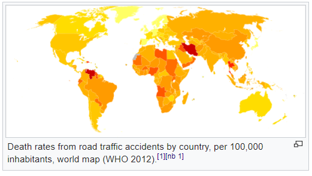
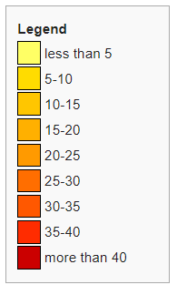

```{r setup, include=FALSE}
options(htmltools.dir.version = FALSE)
```

### Session 2.2 Outline

- Composing Data Graphics

---
class: inverse, center, middle
# Composing Data Graphics

---
### Visual Cues

- Position - where in relation to other things?
- Length - how big (in one dimension)?
- Angle - how wide? parallel to something else?
- Direction - at what slope? Up or down (time series)?
- Area - how big (in two dimensions)
- Shade/Color - to what extent? **Beware of red/green color blindness**

Our ability to perceive differences gets worse as we go down this list. This helps explain why bar charts are usually (always!) preferred over pie charts and why color gradients are often frustrating to interpret.

---
### Visual Cues


[https://en.wikipedia.org/wiki/List_of_countries_by_traffic-related_death_rate](https://en.wikipedia.org/wiki/List_of_countries_by_traffic-related_death_rate)
---
### Coordinate systems

How should we organize our data?

*Most frequently used*
- Cartesian - *x-y* rectangular coordinate system w/perpendicular axes

*Rarely used*
- Polar - points identified  by angle $\theta$ and radius $\rho$

*Used for spatial data*
- Geographic - mapping points on the earth's curved surface to a 2-d plane

---
### Scale

Translating values into visual cues. How does distance in the graphic translate into meaningful differences in quantity?

.pull-left[
- Numeric - typically on a *linear*, *logarithmic*, or *percentage* scale.

- Categorical - *ordinal* (disagree, neutral, agree) or *nominal* (male, female)

- Time 
]
.pull-right[
```{r, echo=FALSE, warning=FALSE, message=FALSE}
library(ggplot2)
library(mdsr)
data(HELPrct)
ggplot(data = HELPrct, aes(x = homeless)) +
  geom_bar(aes(fill= substance), position = "fill") +
  coord_flip() +
  ylab('proportion')
```
]
---
### Layers

Visualizing multidimensional data in a 2-d image in an effective way is a challenge. A few techniques you can use to incorporate many variables are:

.pull-left[
- Small multiples - *facets*. The same plot is shown several times, on a grid, with one discrete variable changing in each plot.

- Layers - colors/gradients, symbols/shapes, text, size

- Animation - works if *time* is the additional variable, but doesn't show all data at once.
]
.pull-right[
```{r, echo=FALSE, message=FALSE, warning=FALSE}
library(mdsr)
data(CIACountries)
ggplot(data = CIACountries, aes(y = gdp, x = educ)) +
  geom_point(alpha = .9, aes(size = roadways)) +
  coord_trans(y = "log10") +
  facet_wrap(~net_users, nrow=3) +
  theme(legend.position="top")
```
]
---
### Color
.pull-left[
- Sequential - ordering of the data has one direction

- Qualitative - no ordering of the data

- Diverging - ordering of the data has two directions
]
.pull-right[
```{r, message=FALSE, warning=FALSE}
library(RColorBrewer)
display.brewer.all()
```
]
---
class: inverse, center, middle

# End of Session 2.2