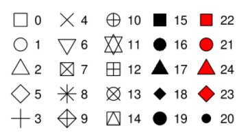

```{r setup, include=FALSE}
options(htmltools.dir.version = FALSE)
```

### Session 2.3 Outline

- ggplot2: A Grammar for Graphics
- Aesthetics
- Geometric Objects
- Statistical Transformations
- Labels and themes
---
class: inverse, center, middle
# ggplot2: A Grammar for Graphics

---
# The Theory

Read it (and references within) here: 
[ http://vita.had.co.nz/papers/layered-grammar.pdf]( http://vita.had.co.nz/papers/layered-grammar.pdf)

---
# The ggplot2 R package...

is contained in the tidyverse. To load it, you can load the tidyverse, or just load it separately:

```{r eval=FALSE}
library(tidyverse)
### OR
library(ggplot2)
```

Plotting with ggplot2 almost always looks like this:

`ggplot(data=) + geom_****() + `

Where `ggplot()` sets up the coordinate system to add the layers (such as `geom_****()`) to.

You can assign your plots to a variable and add more to them later:

```{r, eval = FALSE}
g <- ggplot() + geom_****()
g <- g + xlab()
g <- g + ylab()
g
```
---
class: inverse, center, middle
# Aesthetics
---
### ggplot2 uses aesthetics (`aes()`)

An *aesthetic* is an explicit mapping between a variable and the visual cues that represent its values, or a visual property of the objects in your plot (which we may call levels).

---
### ggplot2 uses aesthetics (`aes()`)

We can change the levels of a point's
- **size**
- shape
- color
- alpha

```{r, message=FALSE, warning=FALSE, fig.align='center', fig.asp=.50}
library(ggplot2)
ggplot(data = mpg) + 
  geom_point(mapping = aes(x = displ, y = hwy, size = class))
```

---
### ggplot2 uses aesthetics (`aes()`)
We can change the levels of a point's
- size
- **shape**
- color
- alpha

```{r, message=FALSE, warning=FALSE, fig.align='center', fig.asp=.50}
library(ggplot2)
ggplot(data = mpg) + 
  geom_point(mapping = aes(x = displ, y = hwy, shape = class))
```
---
### ggplot2 uses aesthetics (`aes()`)
We can change the levels of a point's
- size
- shape
- **color**
- alpha

```{r, message=FALSE, warning=FALSE, fig.align='center', fig.asp=.50}
library(ggplot2)
ggplot(data = mpg) + 
  geom_point(mapping = aes(x = displ, y = hwy, color = class))
```
---
### ggplot2 uses aesthetics (`aes()`)
We can change the levels of a point's
- size
- shape
- color
- **alpha**

```{r, message=FALSE, warning=FALSE, fig.align='center', fig.asp=.50}
library(ggplot2)
ggplot(data = mpg) + 
  geom_point(mapping = aes(x = displ, y = hwy, alpha = class))
```
---
### ggplot2 uses aesthetics (`aes()`)
We can also *set* the levels of a point's aesthetic.

```{r, message=FALSE, warning=FALSE, fig.align='center', fig.asp=.50}
library(ggplot2)
ggplot(data = mpg) + 
  geom_point(mapping = aes(x = displ, y = hwy), color = 'blue', alpha = .5)
```
---
### ggplot2 uses aesthetics (`aes()`)
We can also *set* the levels of a point's aesthetic.

- color = quoted color name
- size = number (in mm)
- shape = number (below chart)
- alpha = number between 0 and 1 (0 = invisible, 1 = solid)


---
class: inverse, center, middle
# Geometric Objects
---
### ggplot uses geometric objects, or geoms (`geom_****()`)

A geom is the geometrical object that a plot uses to represent data.

Every geom function takes a `mapping = aes()` argument, but not every aesthetic can be used with each geom.

ggplot2 contains 30 different geoms, and other extension packages contain even more. But don't worry, there is a cheatsheet here: [http://rstudio.com/cheatsheets](http://rstudio.com/cheatsheets).
---
### ggplot uses geometric objects, or geoms (`geom_****()`)

```{r, fig.align='center', fig.asp=.50}
ggplot(data = mpg) + 
  geom_point(mapping = aes(x = displ, y = hwy))
```
---
### ggplot uses geometric objects, or geoms (`geom_****()`)

```{r, fig.align='center', fig.asp=.50}
ggplot(data = mpg) + 
  geom_smooth(mapping = aes(x = displ, y = hwy))
```
---
### ggplot uses geometric objects, or geoms (`geom_****()`)

You can plot multiple geoms:

```{r, fig.align='center', fig.asp=.50}
ggplot(data = mpg) + 
  geom_smooth(mapping = aes(x = displ, y = hwy)) +
  geom_point(mapping = aes(x = displ, y = hwy))
```
---
### ggplot uses geometric objects, or geoms (`geom_****()`)

You can plot multiple geoms, with less code:

```{r, fig.align='center', fig.asp=.50}
ggplot(data = mpg, mapping = aes(x = displ, y = hwy)) + 
  geom_smooth() +
  geom_point()
```
---
### ggplot uses geometric objects, or geoms (`geom_****()`)

You can plot multiple geoms, with less code, with aesthetics:

```{r, fig.align='center', fig.asp=.50}
ggplot(data = mpg, mapping = aes(x = displ, y = hwy)) + 
  geom_smooth() +
  geom_point(mapping = aes(color = drv))
```
---
### ggplot uses geometric objects, or geoms (`geom_****()`)

You can plot multiple geoms, with less code, with aesthetics:

```{r, fig.align='center', fig.asp=.50}
ggplot(data = mpg, mapping = aes(x = displ, y = hwy)) + 
  geom_smooth(mapping = aes(group = drv)) +
  geom_point(mapping = aes(color = drv))
```
---
class: inverse, center, middle
# Statistical Transformations
---
### Statistical transformations

Some plots do not use the raw data values. Plots like bar plots, histograms, box plots use counts, proportions, or quantiles. ggplot computes these statistical transformations from the data for you.

---
### Statistical transformations

The diamonds dataset:
```{r}
head(diamonds)
```
---
### Statistical transformations

Look at the y-axis. Was there a `count` variable in the dataset?

```{r, fig.align='center', fig.asp=.5}
ggplot(data = diamonds) +
  geom_bar(mapping = aes(x = cut))
```

---
### Statistical transformations

Look at the y-axis. Was there a `count` variable in the dataset? No. `geom_bar` has a statistical transformation associated with it
```{r, fig.align='center', fig.asp=.5}
ggplot(data = diamonds) +
  geom_bar(mapping = aes(x = cut))
```
---
### Statistical transformations

Look at the y-axis. Was there a `count` variable in the dataset? No. `geom_bar` has a statistical transformation associated with it, which you can also use like this:
```{r, fig.align='center', fig.asp=.5}
ggplot(data = diamonds) +
  stat_count(mapping = aes(x = cut))
```
---
### Statistical transformations

What if we want to plot proportions instead? The below code doesn't work unfortunately.
```{r, eval = FALSE, fig.align='center', fig.asp=.5}
ggplot(data = diamonds) +
  stat_prop(mapping = aes(x = cut))
```
---
### Statistical transformations

What if we want to plot proportions instead? This code works!
```{r, fig.align='center', fig.asp=.5}
ggplot(data = diamonds) +
  geom_bar(mapping = aes(x = cut, y = ..count../sum(..count..)))
```
---
class: inverse, center, middle
# Labels and Themes
---
### Labels and themes

Remember that a graph without labels will not help you in telling your story.

Let's see how we can improve the previous plot.

```{r, fig.align='center', fig.asp=.5}
ggplot(data = diamonds) +
  geom_bar(mapping = aes(x = cut, y = ..count../sum(..count..)))
```

---
### Labels and themes

Remember that a graph without labels will not help you in telling your story.

Let's see how we can improve the previous plot.

```{r, fig.align='center', fig.asp=.5}
ggplot(data = diamonds) +
  geom_bar(mapping = aes(x = cut, y = ..count../sum(..count..))) + 
  xlab('Cut of diamond')
```

---
### Labels and themes

Remember that a graph without labels will not help you in telling your story.

Let's see how we can improve the previous plot.

```{r, fig.align='center', fig.asp=.5}
ggplot(data = diamonds) +
  geom_bar(mapping = aes(x = cut, y = ..count../sum(..count..))) +
  xlab('Cut of diamond') +
  ylab('Proportion') +
  ggtitle('Prevalence of each cut of diamond')
```

---
### Labels and themes

ggplot2 also contains many themes, and so do some external packages. You can even build your own!

```{r, fig.align='center', fig.asp=.5}
ggplot(data = diamonds) +
  geom_bar(mapping = aes(x = cut, y = ..count../sum(..count..))) +
  xlab('Cut of diamond') +
  ylab('Proportion') +
  ggtitle('Prevalence of each cut of diamond') +
  theme_dark()
```

---
class: inverse, center, middle

# End of Session 2.3