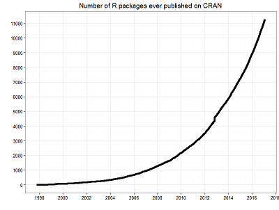

```{r setup, include=FALSE}
options(htmltools.dir.version = FALSE)
```

### Session 2.4 Outline

- R Notebooks

- R packages

---
class: center, inverse, middle
# R Notebooks
---
### R Notebooks

Before R Notebooks...

--

there was R Markdown.

--

And before R Markdown...

--

there was LaTex for Academics and Microsoft Office for everybody else.

---
### R Notebooks

- Literate programming

- Similar to [Jupyter notebooks](http://jupyter.org/)
  + R Notebooks are plain text, so can use git
  
- Interactive computing
  + Results display directly in your source code

- Notebook viewer in the Viewer pane

- Share easily with others (just share the nb.html file)
  + Contains html and Rmd

- Can even be compiled into html, pdf and doc

---
### R Notebooks versus R Markdown

- These are now essentially the same thing

- Before Notebooks, R Markdown did not display output in the source document
  + Output would display in the console or Plots pane
  
- R Markdown cannot be previewed in the Viewer
  + These still must be knitted
  
- Feel free to use whichever you feel most comfortable with

---
class: inverse, center, middle

# R Notebook Demo

---
class: inverse, center, middle
# R Packages
---
### R Packages

By now, you've noticed that we make use of external R packages to do most of our work.

.center[]
---
# How to use R packages
Typically we will load packages into R using `library()`. This should go at the top of your R scripts. In R Markdown, you should have all of your packages loaded in their own R chunk (the first R chunk you create) like this:

````markdown
`r ''````{r, warning = FALSE, message = FALSE}
library(tidyverse)
library(mdsr)
```
````

---
# Function masking

Some function names might be common across multiple R packages, or may already even exist in base R, even though they do different things. This is ok. Whichever package is loaded last will have priority.

Or, you can use the namespace (package name) to specify which package you are referring to. Instead of typing

`filter()`

which exists in multiple packages (dplyr and stats), you can use

`dplyr::filter()`
---
class: inverse, center, middle

# End of Session 2.4