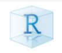

```{r setup, include=FALSE}
options(htmltools.dir.version = FALSE)
knitr::opts_chunk$set(fig.align = "center", fig.asp=.5, message = FALSE, warning = FALSE)
```

### Session 3.2 Outline

- When to use R Markdown
- R Basics
  + *R for Data Science - Section 4*
- R Markdown Basics
- R Scripts
- R Projects

---
class: inverse, center, middle

# When to use R Markdown

---
### Do I always use R Markdown in my work?

No. My workflow (once I start the *real* data work) typically looks like this:

- Create folders for my code, sample data, and documents 
  + I like the [Microsoft Team Data Science Process](https://docs.microsoft.com/en-us/azure/machine-learning/team-data-science-process/overview)
- Using RStudio, write code in R scripts
  + Hit File -> New File -> R Script OR select the new file icon arrow and choose 'R Script'
  + Each script is for a specific task I'm doing (e.g. data clean up; adhoc analyses; create new data set from existing data set)
  + I may also be writing Hive, SQL, or other code during this time, usually not in RStudio

  
---
### Do I always use R Markdown in my work?

No. My workflow (once I start the *real* data work) typically looks like this:

- Once I have *tangible* results to show, that is when I start thinking about if I need to document the results
  + Lots of analyses are minor, go nowhere, and I don't formalize these
  + If yes, that is when I start an R Markdown document
- On occasion I'm asked to do some quick analyses and report the results to business (e.g. how did the model perform last month? what is the expected $$ savings during out pilot?)
  + These I will write up in R Markdown
---
class: center, middle, inverse

# Demo of R Markdown report from work

---
class: center, middle, inverse

# R Basics!!!

---
### R Basics

Congratulations!! You've made it this far.

.center[]
---
### R Basics

Follow along in RStudio...

- R is case sensitive, but white space doesn't matter

--

- Use R as calculator (type these directly in the lower-left Console pane)

```{r}
2 + 3
sin(pi / 2)
```
---
### R Basics

- R is case sensitive, but white space doesn't matter

- Use R as calculator

- Create new objects with: `<-` 
  + `object_name <- value`
  + Do **not** use `=` to create new objects
  + Keyboard shortcut: `Alt -` (minus)
  
```{r}
x <- 3 * 4
x
```
---
### R Basics

- R is case sensitive, but white space doesn't matter

- Use R as calculator

- Create new objects with: `<-` 
  + `object_name <- value` 
  + Do **not** use `=` to create new objects
  + Keyboard shortcut: `Alt -` (minus)
  
- Object names must start with a letter, and can only contain letters, numbers, `_` and `.` 
  + **Be descriptive!** Don't use `dat1, dat2, x1, x2`, etc.
  + **Be careful!** Don't use `data`, `function`, `mean`, or any name that may already be taken by an R function
  + Style tip: use lower snake_case (e.g. `my_variable_name`)

---
### R Basics

- Inspect objects

```{r, error=TRUE}
r_rocks <- 2 ^ 3
r_rock
R_rocks
```
---
### R Basics

- Inspect objects

- Calling functions

```{r, eval = FALSE}
function_name(argument1 = value1, argument2 = value2, ...)
```

```{r}
seq(1, 10, length.out = 5)
```

---
### R Basics

- Inspect objects

- Calling functions

```{r, eval = FALSE}
function_name(argument1 = value1, argument2 = value2, ...)
```

- Quotes and Parentheses always come in pairs

```
> x <- "hello world
+
```

*that plus sign means that R is waiting for you to complete something*
---
### R Basics

- Inspect objects

- Calling functions

```{r, eval = FALSE}
function_name(argument1 = value1, argument2 = value2, ...)
```

- Quotes and Parentheses always come in pairs

- Keyboard shortcuts: press `Alt + Shift + K`
  + Hit `Esc` to close it

--

- Get help on functions and datasets using `?function_name` or `?data_name`
---
### R Markdown Basics

Open a new R Markdown file (File -> New File -> R Markdown OR New file icon dropdown -> R Markdown).

In-class demo of:

- YAML front matter
- Code Chunks and code chunk options
- Code inline
- Text
  + highlighting
  + font sizes and headers
  + bold and italic
  + bulleted lists
  
---
### R Scripts

Open a new R script file (File -> New File -> R Script OR New file icon dropdown -> R Script OR hit `Ctrl + Shift + N`). 

- Contains R code and comments, nothing else
- Code must be interpreted by R in the R console
- Send code to the R console using keyboard shortcuts or the `Run` button
- Scripts can be *sourced* by other scripts, meaning all code will be run at once

```{r, eval = FALSE}
# this is a comment. You can tell by the # at the front.
# be generous with your comments

# Run code one line at a time using Ctrl + Enter
# load ggplot2
library(ggplot2)

# plot barchart of cut variable
ggplot(data = diamonds) + 
  geom_bar(mapping = aes(x = cut))
```
---
### R Projects

Using R Projects allows you to:

- divide your work in a straightforward way

- keeps track of each project's
  + working directory (shown in Files pane)
  + history (History pane and Console pane)
  + workspace (Environment pane)
  + scripts (Source pane)
  
- easy to switch between projects
  + drop-down upper right corner of RStudio

.center[]

---
### RStudio 

Take a second to play around with RStudio's panes and look through the drop-down menus. 

Change the appearance of RStudio in the Global Options. Dark background with off-white text is easier on the eyes.

Explore your file system in the File pane. You should be able to find most files that exist on your computer here.


---
class: inverse, center, middle

# End of Session 3.2