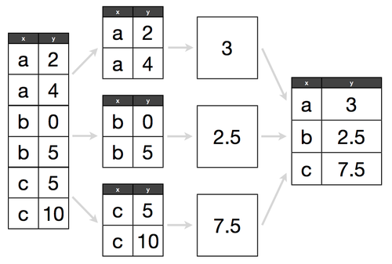

```{r setup, include=FALSE}
options(htmltools.dir.version = FALSE)
knitr::opts_chunk$set(fig.align = "center", fig.asp=.5, message = FALSE, warning = FALSE)
```

### Housekeeping

- Homework:
  + Questions on Homework 3?
  + Homework 2 solutions are up
- Readings for next week
- Midterm will be assigned next Tuesday (2/26) and due the following Tuesday (3/5)
  + It will be comprehensive, including material from next week
  + It is worth 30% of your grade
  + Late assignments will get a zero grade 

---
class: inverse, center, middle

# Before we begin...

---

### Turn your chairs towards your neighbors and talk to each other for 5 minutes

Bump elbows if you don't like shaking hands

Some topics of conversation:

- Your name
- Where you're from
- Your superpower
- Your kryptonite
- Your favorite musician/band
- A justification for the ontological necessity of modern man's existential dilemma
- What you're most curious about in Data Science

.center[]

---
### Session 4.1 Outline

- The summarize() verb
  + *R for Data Science - Section 5.6*
  + *Modern Data Science with R - Chapter 4.1.4*

---
class: inverse, center, middle
# The summarize() verb
---
### The `summarize()` verb

`summarize()` only makes sense if you *group by* a variable

```{r, warning=FALSE, message=FALSE}
library(dplyr)
library(nycflights13)
summarize(flights, delay = mean(dep_delay, na.rm = TRUE))
```
---
### The `summarize()` verb


---
### The `summarize()` verb and the pipe

```{r}
flights %>% 
  group_by(dest) %>% 
  summarise(
    count = n(),
    dist = mean(distance, na.rm = TRUE),
    delay = mean(arr_delay, na.rm = TRUE)
  )
```
---
### na.rm = TRUE?

Recall that missing values are represented in R as NA (not available). When working with *real* data, you'll have to be aware of how R, and R aggregation functions, might treat NA values.

```{r}
x <- NA
x == NA

is.na(x)

NA ^ 0
NA | TRUE
```
---
### na.rm = TRUE?

Recall that missing values are represented in R as NA (not available). When working with *real* data, you'll have to be aware of how R, and R aggregation functions, might treat NA values.

For example, many aggregation functions (`mean()`, `sd()`, `var()`, `median()`, etc.) have an argument called `na.rm` (NA dot remove). Set this to `TRUE` to remove NA values before computing.

```{r}
x <- c(5,5,5,5,5,5,5,NA)
mean(x)

mean(x, na.rm = TRUE)
```
---
### The pipe operator `%>%`

Recall 

`function_1 %>% function_2 %>% function_3 %>% ...` 
  
is read 
  
`function_1 then function_2 then function_3 then ...`

And

`x %>% f(y)` turns into `f(x, y)`
---
### Counts with `summarize()`

Counting number of observations, number of distinct observations, and number of non-missing observations:

```{r}
flights %>% 
  group_by(dest) %>% 
  summarise(
    count = n(),
    count_dist = n_distinct(arr_delay),
    count_non_miss = sum(!is.na(arr_delay))
  )
```
---
### Counts without `summarize()`

Counting number of observations:

```{r}
flights %>% 
  count(dest)
```
---
### Common `summarise()` functions

Measures of center:  
`mean()`  
`median()` - the point at which 50% of data falls above and below (robust)  
  
Measures of spread:  
`sd()` - std dev  
`IQR()` - inter-quartile range (75th percentile - 25th percentile)  
`mad()` - median absolute deviations from the median (robust)  

Measures of rank:  
`min()`  
`max()`  
`quantile()` - example: `quantile(x, .25)` will find the 25th percentile of `x` 

Measures of position:  
`first(x)`  
`nth(x, 2)`   
`last(x)`
---
### Counts and proportions of logicals

Logicals evaluate to `TRUE` or `FALSE`. When plugging in logicals to numeric functions, `TRUE = 1` and `FALSE = 0`.

```{r}
flights %>%
  group_by(year, month, day) %>% 
  summarise(non_miss = sum(!is.na(dep_time)), 
            n_early = sum(dep_time < 500, na.rm = TRUE),
            prop_early = mean(dep_time < 500, na.rm = TRUE))
```
---
### Pop quiz

If we define cancelled flights like so:

```{r, eval = FALSE}
flights %>% 
  filter(is.na(dep_delay) | is.na(arr_delay))
```

What is the number and proportion of cancelled flights on Febuary 20th, 2013? Use summarize along with the sum and mean of logical values in your final answer.

Hint: the final answer is:

```{r, echo = FALSE}
flights %>% mutate(cancelled = (is.na(dep_delay) | is.na(arr_delay))) %>% 
  group_by(month, day) %>%
  summarize(num_cancelled = sum(cancelled),
            prop_cancelled = mean(cancelled)) %>%
  filter(month == 2, day == 20)
```
---
class: inverse, center, middle

# End of Session 4.1