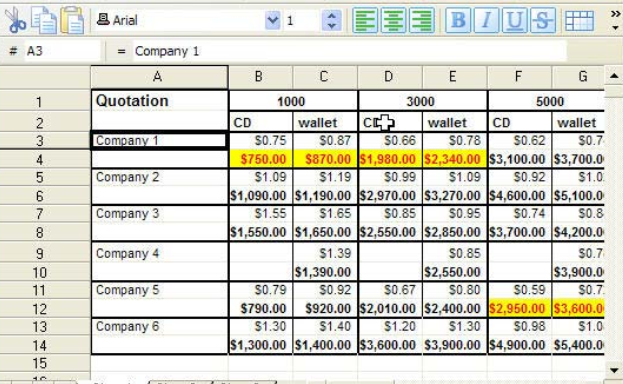

```{r setup, include=FALSE}
options(htmltools.dir.version = FALSE)
knitr::opts_chunk$set(fig.align = "center", fig.asp=.5, message = FALSE, warning = FALSE)
```
### Session 4.3 Outline

- Tidy data
  + *R for Data Science - Section 12*
  + *Modern Data Science with R - Chapter 5.1*
- Data types & structures
  + *R for Data Science - Section 10*

---
class: inverse, center, middle
# Tidy data
---
### What is tidy data?

Tidy data is a consistent way to organize your data into a tabular format of rows and columns. With a little effort up front, you're data munging and wrangling will be easier and faster. 

For the theory, you can read this paper: [http://www.jstatsoft.org/v59/i10/paper](http://www.jstatsoft.org/v59/i10/paper)
---
### Tidy data

1. Each column is a variable
2. Each row is an observation
3. Each cell is a value


---
### Why make data tidy?

1. Keeps your work consistent.  
2. R likes to work with vectors of values. Most R functions operate on vectors (recall the aggregation functions). Tidy data allows you to exploit this.

```{r, message=FALSE, warning=FALSE}
library(tidyverse)
diamonds
```

---
### Why make data tidy?

1. Keeps your work consistent.  
2. R likes to work with vectors of values. Most R functions operate on vectors (recall the aggregation functions). Tidy data allows you to exploit this.

```{r, message=FALSE, warning=FALSE}
library(tidyverse)
diamonds %>% group_by(cut) %>%
  summarize(avg_price = mean(price, na.rm = TRUE))
```
---
### How can we make this tidy?

This is a table of HIV prevalency for countries and years. Why would you say this data is not tidy? How can we change it so that it is?

```{r, echo=FALSE, warning=FALSE, message=FALSE}
hiv <- as.tibble(data.frame(Country = c('France', 'South Africa', 'United States'),
                  `Y1979` = c(NA, NA, .318), `Y1989` = c(NA, NA, NA),
                  `Y1999` = c(.3, 14.8, 0.5), `Y2009` = c(.4, 17.2, .6)))
names(hiv) <- c('Country', 'Y1979', 'Y1989', 'Y1999', 'Y2009')
```
```{r, echo = FALSE}
knitr::kable(hiv, 'html')
```
---
### Excel files

Often, excel files are not tidy.



---
class: inverse, center, middle
# Data types & structures
---
### Data types & structures

We already know these *types* of variables: 

- categorical
- ordinal
- continuous

In R, these are defined as these types:

- integer (`int`) - numeric
- double (`dbl`) - numeric 
- character (`chr`) - strings
- datetime (`dttm`) - time
- factor (`fct`) - categorical variables with a set number of pre-defined levels
- ordinal (`ord`) - ordered factor variable

---
### Data types & structures

We've heard of these data structures:

- vectors of numbers or strings (using the concatenate function `c()`)
- data frames
- tibbles 

But there are also these (we won't be working with these):

- lists - similar to dictionaries in Python
- matrices - just like matrices from linear algebra
---
### Tibbles

Tibbles are different from data frames in two ways:

- How they print to your screen - they only print enough data that can fit on the screen **and** they show the variable types.
- How you can subset them

---
### Creating a tibble

```{r}
data(iris)
class(iris)
iris <- as_tibble(iris)
class(iris)
```
---
### Run this code in your console and see what happens:

```{r, eval = FALSE}
data(iris)
iris <- as.data.frame(iris)
iris
iris <- as_tibble(iris)
iris
```
---
### Creating a tibble from scratch

```{r}
my_tbl <- tibble(
  var_one = c(1,2,3,4,5),
  var_two = c('a', 'b', 'c', 'd', 'e'),
  var_three = c(2.1, 1.2, 5.5, 2.8, 7.6)
)
my_tbl
```
---
### Subsetting tibbles

If you want to extract a single column:

```{r}
my_tbl$var_one # by name
my_tbl[['var_one']] # by name
my_tbl[[1]] # by position
```

If using the pipe, you need to use the `.` placeholder

```{r}
my_tbl %>% .[['var_one']]
```
---
### Subsetting tibbles

If you want to extract multiple columns:

Use `select()`!!!
---
class: inverse, center, middle

# End of Session 4.3