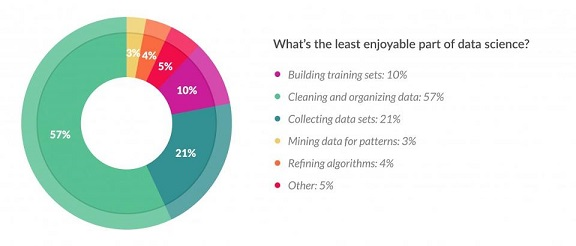
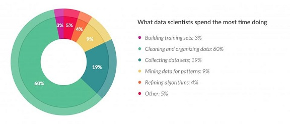

```{r setup, include=FALSE}
options(htmltools.dir.version = FALSE)
knitr::opts_chunk$set(fig.align = "center", fig.asp=.5, message = FALSE, warning = FALSE)
```

### Housekeeping

- Any questions?
- Homework 4 solutions are up
- We'll review the midterm next week
- Homework 6 is due next Tuesday before class

---
### Session 6.1 Outline

- Review what we've done
- Review what we're going to do
---
class: inverse, center, middle
# What we've done 
---
### What is a data scientist? 


---
### What does a data scientist do?

 
---
### How and why do they do it?

- Sometimes for machines (predictive accuracy), sometimes for humans (to understand and take action)

- Ethically

- With lots of different tools
  + Data storage: SQL, Hive, Hadoop, NoSQL, flat files, etc.
  + Computing: R, Python, Matlab, SAS, Scala, Spark, laptops, servers, cloud, etc.
  + Reporting: Tableau, Powerpoint, Word, Excel, etc.
  + Deploying: platforms, developers, etc.

- In a reproducible way
  + using version control (git, svn)
  + clean and commented code that actually runs!
  + R/Jupyter Notebooks, R Markdown, and many other tools for reporting and technical documentation

---
.center[]
---
### What does the future of data science look like?

.pull-left[]

.pull-right[]

---
class: inverse, center, middle
# What we're going to do
---
### Week 6

- Samples and sampling distributions
- Simpson's paradox
- Recoding variables
- Intro to linear regression

### Week 7

- More with data importing
- Finish up with linear regression

### Week 8

- R functions and loops  
- Spatial and time series data

---
### Week 9

- A/B testing

### Week 10

- In-class final
- Discussion topics (AI/Machine learning/Deep learning; automation; text/image data)

---
class: inverse, center, middle

# End of Session 6.1