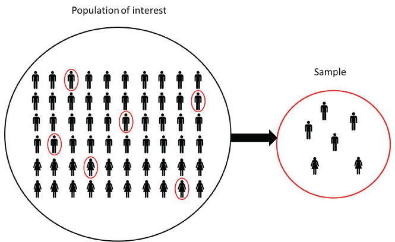

```{r setup, include=FALSE}
options(htmltools.dir.version = FALSE)
knitr::opts_chunk$set(fig.align = "center", fig.asp=.5, message = FALSE, warning = FALSE)
```

```{r, message = FALSE, warning=FALSE, echo = FALSE}
library(tidyverse)
```

### Session 6.2 Outline

- Fundamental statistics concepts
  + Why do we need statistics?
  + Samples and populations
  + Sample statistics
  + *Modern Data Science with R - Chapter 7*
---
class: inverse, center, middle
# Statistical concepts
---
### Why do we need statistics?

Humans are very good at identifying patterns in visualizations, even with random noise, but...
  
```{r, echo=FALSE, warning=FALSE, message=FALSE}
library(tidyverse)
```

```{r, echo = FALSE, fig.asp=.5}
diamonds %>% ggplot(aes(x = carat, y = price)) + 
  geom_point() +
  theme_bw()
```

---
### Why do we need statistics?

humans are also very good at identifying patterns that aren't there. 

Which one of these represents an actual sequence of flipping a fair coin, and which one was a human simulating the flipping of a fair coin?

```{r, echo = FALSE}
ht <- sample(c('H', 'T'), replace = TRUE, size = 100)
```

A:

`T T T T T T T T T H H T T T T H H T H H H T T T H T H T H T H H T T T H H H T T T H T H T T H T H H H H T H T H H T T H H H T T T T H T T T H T H T H T T H T T T H T H H H T H H T T H H H T T H T T H`

B:

`H T T H T H T H T T H T H H T H H H T H T T H T H T T H T H T H H H T T H H T T H T T H H T H T H T H T T H T H T H T T H T H H T H H H T H T T H T H T T H T H T H H H T T H H T T H T T H H T H T H T`

---
### Why do we need statistics?

Statistics will help us distinguish between random noise and significant patterns, as well as identify patterns that are too complex to be visualized.

```{r, echo = FALSE}
ggplot(data = diamonds, mapping = aes(x = cut, y = price)) + 
  geom_boxplot()
```
---
### Do we still need statistics when we have BIG DATA?

Short answer: yes.

Long answer: we can discuss during Week 10.


## `Big Data + Bad Analysis = Big Bad Decisions`

---
class: inverse, center, middle
# Populations & Samples
---
### Populations

Typically what you are interested in describing:

- The entire population of...

  + customers
  
  + users
  
  + transactions
  
  + etc.

This is the big pool we draw our data from.

---
### Samples

A *fixed* or *given* set of data from our larger population.

Example: I want to understand all of our users that call in to complain about our products. For various reasons, I do not have access to every single call, so I take a random sample of calls which should be **representative** of the population and do my analysis on that.

.center[]

---
class: inverse, center, middle
# Sample Statistics
---
### Recall the `flights` data

```{r}
library(nycflights13)
glimpse(flights)
```
---
### Pretend this is the entire population of New York flights

.pull-left[

```{r, fig.width=7.5}
flights %>% ggplot() +
  geom_histogram(aes(x = air_time), binwidth = 10) +
  theme_bw()
```

]
.pull-right[
]
---
### Pretend this is the entire population of New York flights

What should a random sample from this population look like?

.pull-left[

```{r, fig.width=7.5}
flights %>% ggplot() +
  geom_histogram(aes(x = air_time), binwidth = 10) +
  theme_bw()
```

]
.pull-right[
]
---
### Sample size = 30

.pull-left[

```{r, fig.width=7.5}
flights %>% ggplot() +
  geom_histogram(aes(x = air_time), binwidth = 10) +
  theme_bw()
```

]
.pull-right[
```{r, fig.width=7.5}
flights %>% sample_n(30) %>% ggplot() +
  geom_histogram(aes(x = air_time), bindwidth = 10) +
  theme_bw()
```
]

---
### Sample size = 300

.pull-left[

```{r, fig.width=7.5}
flights %>% ggplot() +
  geom_histogram(aes(x = air_time), binwidth = 10) +
  theme_bw()
```

]
.pull-right[
```{r, fig.width=7.5}
flights %>% sample_n(300) %>% ggplot() +
  geom_histogram(aes(x = air_time), binwidth = 10) +
  theme_bw()
```
]
---
### Sample size = 3000
.pull-left[

```{r, fig.width=7.5}
flights %>% ggplot() +
  geom_histogram(aes(x = air_time), binwidth = 10) +
  theme_bw()
```

]
.pull-right[
```{r, fig.width=7.5}
flights %>% sample_n(3000) %>% ggplot() +
  geom_histogram(aes(x = air_time), binwidth = 10) +
  theme_bw()
```
]
---
### Pretend this is the entire population of New York flights

.pull-left[

```{r, fig.width=7.5}
flights %>% summarize(min_time = min(air_time, na.rm = TRUE),
                      med_time = median(air_time, na.rm = TRUE),
                      mean_time = mean(air_time, na.rm = TRUE),
                      IQR_time = IQR(air_time, na.rm = TRUE),
                      max_time = max(air_time, na.rm = TRUE)) %>%
  gather(key = stats, value = values)
```

]
.pull-right[
]
---
### Sample size = 30

.pull-left[

```{r, fig.width=7.5}
flights %>% summarize(min_time = min(air_time, na.rm = TRUE),
                      med_time = median(air_time, na.rm = TRUE),
                      mean_time = mean(air_time, na.rm = TRUE),
                      IQR_time = IQR(air_time, na.rm = TRUE),
                      max_time = max(air_time, na.rm = TRUE)) %>%
  gather(key = stats, value = values)
```

]
.pull-right[
```{r, fig.width=7.5}
flights %>% sample_n(30) %>% summarize(min_time = min(air_time, na.rm = TRUE),
                      med_time = median(air_time, na.rm = TRUE),
                      mean_time = mean(air_time, na.rm = TRUE),
                      IQR_time = IQR(air_time, na.rm = TRUE),
                      max_time = max(air_time, na.rm = TRUE)) %>%
  gather(key = stats, value = values)
```
]

---
### Sample size = 300

.pull-left[

```{r, fig.width=7.5}
flights %>% summarize(min_time = min(air_time, na.rm = TRUE),
                      med_time = median(air_time, na.rm = TRUE),
                      mean_time = mean(air_time, na.rm = TRUE),
                      IQR_time = IQR(air_time, na.rm = TRUE),
                      max_time = max(air_time, na.rm = TRUE)) %>%
  gather(key = stats, value = values)
```

]
.pull-right[
```{r, fig.width=7.5}
flights %>% sample_n(300) %>% summarize(min_time = min(air_time, na.rm = TRUE),
                      med_time = median(air_time, na.rm = TRUE),
                      mean_time = mean(air_time, na.rm = TRUE),
                      IQR_time = IQR(air_time, na.rm = TRUE),
                      max_time = max(air_time, na.rm = TRUE)) %>%
  gather(key = stats, value = values)
```
]
---
### Sample size = 3000
.pull-left[

```{r, fig.width=7.5}
flights %>% summarize(min_time = min(air_time, na.rm = TRUE),
                      med_time = median(air_time, na.rm = TRUE),
                      mean_time = mean(air_time, na.rm = TRUE),
                      IQR_time = IQR(air_time, na.rm = TRUE),
                      max_time = max(air_time, na.rm = TRUE)) %>%
  gather(key = stats, value = values)
```

]
.pull-right[
```{r, fig.width=7.5}
flights %>% sample_n(3000) %>% summarize(min_time = min(air_time, na.rm = TRUE),
                      med_time = median(air_time, na.rm = TRUE),
                      mean_time = mean(air_time, na.rm = TRUE),
                      IQR_time = IQR(air_time, na.rm = TRUE),
                      max_time = max(air_time, na.rm = TRUE)) %>%
  gather(key = stats, value = values)
```
]
---
### Uncertainty

We will not cover confidence intervals in this class (don't be bummed), but this is a topic worth studying.

BUT...

let's talk about the standard error!!

### Standard error $\neq$ standard deviation
---
### Uncertainty and the Standard Error

Take a sample of flights, of size n = 300, and calculate the mean and standard deviation of `air_time`...

```{r, eval = FALSE}
flights %>% sample_n(300) %>% 
  summarize(mean_time = mean(air_time, na.rm = TRUE),
                        sd_time = sd(air_time, na.rm = TRUE))
```

...and repeat. What do you notice?
---
### Uncertainty and the Standard Error

You should have noticed that each time you take a new sample, the mean and standard deviation of `air_time` changes a little.

If we repeat this over and over again and collect all results, we can look at the distributions of the sample mean and sample standard deviation.

What do you think a histogram of all of your sample means will look like?

--

```{r, echo = FALSE}
all_means <- all_sds <- c()
for(i in 1:1000) {
  flts <- flights %>% sample_n(300)
  all_means <- c(all_means, mean(flts$air_time, na.rm = TRUE))
  all_sds <- c(all_sds, sd(flts$air_time, na.rm = TRUE))
}
plot_data <- tibble(all_means, all_sds)
plot_data %>% ggplot() +
  geom_histogram(aes(x = all_means)) + theme_bw()
```
---
### Uncertainty and the Standard Error

You should have noticed that each time you take a new sample, the mean and standard deviation of `air_time` changes a little.

If we repeat this over and over again and collect all results, we can look at the distributions of the sample mean and sample standard deviation.

```{r, echo=FALSE}
plot_data %>% ggplot() +
  geom_histogram(aes(x = all_sds)) + theme_bw()
```
---
### Uncertainty and the Standard Error

The standard error is the standard deviation (spread) *of the sampling distribution* - it is a measure of the spread of our sample statistics (the sample average in the plot below).

In this case, the standard error (standard deviation of our sample means) is `r sd(plot_data$all_means)`.

```{r, echo=FALSE}
plot_data %>% ggplot() +
  geom_histogram(aes(x = all_means)) + theme_bw()
```
---
### FUN FACT

The theoretical formula for the standard error is:

$$\huge \frac{\sigma}{\sqrt{N}}$$

where $\Huge \sigma$ is the standard deviation of our **population**, and N is the sample size. 

In our case (`\(\Huge \sigma\)` = `r sd(flights$air_time, na.rm = TRUE)`, N = 300)

```{r} 
sd(flights$air_time, na.rm = TRUE)/sqrt(300)
```

This is pretty darn close to what we got: `r sd(plot_data$all_means)`

---
### Pop Quiz

- What do you think is the mean (center) of this distribution?

- What do you think happens to the standard error if our sample size **increases**?

- What do you think happens to the shape of this distribution if our sample size **decreases**?

```{r, echo=FALSE}
plot_data %>% ggplot() +
  geom_histogram(aes(x = all_means)) + theme_bw()
```

---
class: inverse, center, middle

# End of Session 6.2