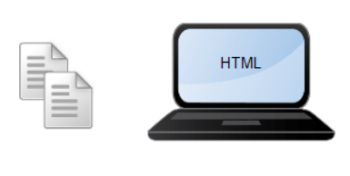
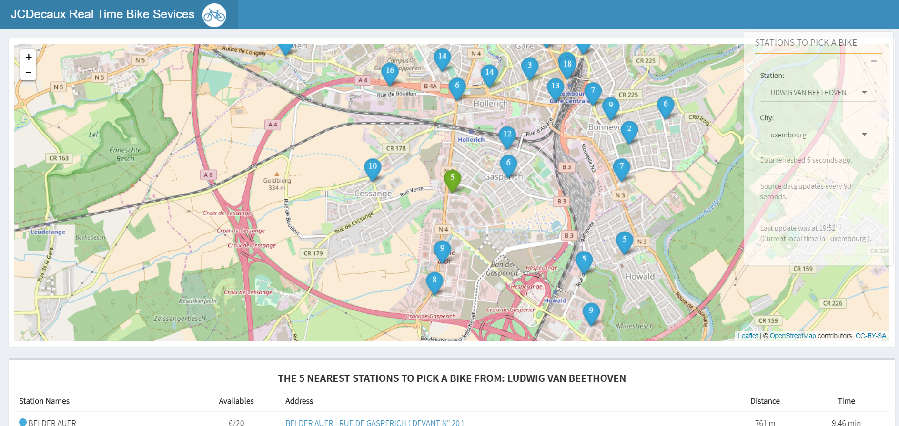

```{r setup, include=FALSE}
options(htmltools.dir.version = FALSE)
knitr::opts_chunk$set(fig.align = "center", fig.asp=.5, message = FALSE, warning = FALSE)
```
### Session 4.2 Outline

- Data Import
  + Data sources
  + Flat files
  + Web scraping
  + API's
  + *R for Data Science - Section 11*
  + *Modern Data Science with R - Chapter 5.5*
- Data Export
  + Flat files
  + R-specific format
  + feather
- R packages for working with data sources

---
class: inverse, center, middle

# Some motivation for this week: [a Shiny App built in R](http://blog.rdata.lu/visualization/bike/)

---
class: inverse, center, middle
# Data Import
---
class: inverse, center, middle
# Where does your data come from?
---
### Typical data sources

- Flat files (csv, txt, etc.) 
- Software specific formats (Excel, MATLAB, SAS, etc.)
- SQL database (MySQL, MSFT SQL Server, Oracle, etc.) 
- Hive (Impala, Presto, etc.)
- HDFS (Hadoop distributed file system)  
- Web pages (scraping)  
- API's  
- NoSQL (Hbase, MongoDB, etc.)
---
### Typical data sources **that I use**

- **Flat files (csv, txt, etc.)**  
- **Software specific formats (Excel, MATLAB, SAS, etc.)**
- **SQL database (MySQL, MSFT SQL Server, Oracle, etc.)**   
- **Hive (Impala, Presto, etc.)**  
- **HDFS (Hadoop distributed file system)**  
- Web pages (scraping)  
- API's (application programming interface)  
- NoSQL (Hbase, MongoDB, etc.)

---
### Importing data with R

R has packages for importing data from many of the sources listed on the previous slides. We won't be learning big data or databases in this course, but there are separate courses you can take, and the textbook **Modern Data Science with R** has chapters devoted to databases (Ch 12, 13) and spatial data (Ch 14).

For this session we'll play with importing:

- flat files  
- data from websites
- data from API's

.center[]
---
### Importing flat files with the tidyverse

As always, we will use tidyverse functions for importing flat files into R. Specifically, we are using functions from the `readr` package.

```{r, warning=FALSE, message=FALSE}
library(tidyverse)
```
```{r, eval = FALSE}
?readr
```

`Description: The goal of 'readr' is to provide a fast and friendly way to read rectangular data (like 'csv', 'tsv', and 'fwf'). It is designed to flexibly parse many types of data found in the wild, while still cleanly failing when data unexpectedly changes.`
---
### Importing flat files with the tidyverse

Download the flights csv file from Canvas in this week's module, and we'll load it into R using the `readr` package function `read_csv()`. What is the output?

```{r, eval = FALSE}
library(tidyverse)
file_path <- 'path/to/file_name.csv'
csv_data <- read_csv(path = file_path)
```
---
### Importing flat files with the tidyverse

`read_csv()` has many arguments for dealing with:

- column names (col_names)
- column types (col_types)
- missing values (na)
- white space in fields (trim_ws)
- skipping rows (skip)
---
### Importing flat files with the tidyverse

Not all countries like to use commas as a delimiter. 

For semicolon (`;`) delimited, use `read_csv2()`

For tab delimited, use `read_tsv()`

All others, use `read_delim()` and specify the delimiter with the `delim` argument.

---
### **FYI**

If importing and working with very large flat files (100s of MBs to GBs), the preferred package for this is the `data.table` package. Read more about it here: [https://github.com/Rdatatable/data.table/wiki](https://github.com/Rdatatable/data.table/wiki)
---
### Web scraping with `rvest`

Let's scrape a webpage with R's `rvest` package.

First you'll need to install `rvest` and make sure it installed correctly:
```{r, eval=FALSE}
install.packages('rvest')
library('rvest')
```
---
### Web scraping with `rvest`

Go to [www.imdb.com](http://www.imdb.com), type in your favorite **movie** into IMDB's search bar and hit Enter.

In your browser, look at the source `html` code for the page.

Chrome - CTRL + U (COMMAND + OPTION + U on macOS)

Safari - COMMAND + OPTION + U

Edge - F12 or CTRL + U

Firefox - CTRL + U (COMMAND + U on macOS)

---
### Web scraping with `rvest`

Copy the URL and replace my URL below with yours.

```{r, warning=FALSE, message=FALSE}
library(rvest)

## if you don't have the rvest package, install it first:
# install.packages('rvest')

big_lebowski <- read_html("http://www.imdb.com/title/tt0118715/?ref_=nv_sr_1")
class(big_lebowski)
```
---
### Web scraping with `rvest`

What does the output look like?

```{r}
big_lebowski
```

Ok, this doesn't make any sense. Luckily there are functions that we can use to help parse this information. We won't get into these in detail, this is just for fun and illustrative purposes.
---
### Web scraping with `rvest`

Let's output the cast of your movie.

```{r}
big_lebowski %>%
  html_nodes("table") %>%
  .[[1]] %>%
  html_table()
```
---
### JSON

JavaScript Object Notation - a very common, language-independent data format

```{r}
chocolate_brands <- c('
  [
    {
      "name" : "Dove Bar",
      "founded" : 1956
    },
    {
      "name" : "Toblerone",
      "founded" : 1908
    }
  ]')

chocolate_brands
```
---
### JSON

We can parse the JSON data and put it in a nice tabular format using the `jsonlite` package.

```{r}
library(jsonlite)

choco_json <- fromJSON(chocolate_brands)
choco_json
```
---
### API's

Back to our motivating example. [This Shiny app](http://blog.rdata.lu/visualization/bike/) was made in R, using the `shiny` package.

Brief blog post about the app is [here](http://www.blog.rdata.lu/post/2018-02-20-api-shiny-nice-app/).

Raw code is on Github [here](https://github.com/krosamont/shiny_bike/), but for a look at how the data is imported, go to Github [here](https://github.com/krosamont/shiny_bike/blob/master/server.R), lines 19-33.


---
### API's

The blog specifies the format of the input data from the API:

{
  "number": 123,
  "contract_name" : "Paris",
  "name": "stations name",
  "address": "address of the station",
  "position": {
    "lat": 48.862993,
    "lng": 2.344294
  },
  "banking": true,
  "bonus": false,
  "status": "OPEN",
  "bike_stands": 20,
  "available_bike_stands": 15,
  "available_bikes": 5,
  "last_update": <timestamp>
}

If you want to pull the data yourself, you'll need an API Key, which you can get from here: [https://developer.jcdecaux.com/#/login](https://developer.jcdecaux.com/#/login)

```{r, eval = FALSE}
library(jsonlite)

# Pulling data for Dublin
url <- paste0("https://api.jcdecaux.com/vls/v1/stations?contract=",'Dublin',"&apiKey=YOUR_API_KEY")
df_api <- fromJSON(url)
```
---
class: inverse, center, middle
# Demo of API Data Ingestion
---
class: inverse, center, middle
# Data Export
---
### Exporting into flat files

We can export data into flat files using the same `readr` package. 

`write_csv()` - to write to a csv file  
`write_tsv()` - to write to a tab delimited file  
`write_delim()` - to choose a delimiter  

```{r, eval = FALSE}
write_delim(csv_data, delim = '|', path = 'path/to/new_file_name.csv')
```
---
### **Exporting** (and importing) R-specific formats

R has multiple formats for exported data:

- .RData (and the abbreviated .rda)
- .rds (*preferred*)

We will use rds and avoid confusion. You can save any single R object (data frames, tibbles, models, vectors, matrices, etc.) as an rds file like this:

```{r, eval = FALSE}
saveRDS(flights, file = "path/to/file_name.rds")
```
---
### Exporting (and **importing**) R-specific formats

R has multiple formats for exported data:

- .RData (and the abbreviated .rda)
- .rds (*preferred*)

We will use rds and avoid confusion. You can save any single R object (data frames, tibbles, models, vectors, matrices, etc.) as an rds file like this:

```{r, eval = FALSE}
saveRDS(flights, file = "path/to/file_name.rds")
```

and you can import rds files like this:

```{r, eval = FALSE}
object_name <- readRDS(file = "path/to/file_name.rds")
```
---
### Feather

`feather` is a binary file format for data frames in both R and Python, meaning you can import and export the same data in both R and Python with ease. Read more about it here: [https://blog.rstudio.com/2016/03/29/feather/](https://blog.rstudio.com/2016/03/29/feather/)
---
class: inverse, center, middle
# R packages for working with data sources
---
### R packages
This list is not exhaustive.  

**`haven`** - SPSS, Stata, and SAS    
**`readxl`, `XLConnect`** - basic excel files (.xls and .xlsx)  
**`jsonlite`** - json  
**`xml2`** - xml  
**`rvest`** - html  
**`DBI`** - interface for all sorts of relational databases. Used in conjunction with packages such as **`RODBC`**, **`RSQLite`**, **`RMySQL`**, **`RSQLServer`**, **`RPostgreSQL`**.  
**`RJDBC`**, **`rJava`** - Hive   
**`RHadoop`** - hadoop  
**`twitteR`**, **`Rfacebook`**, more - twitter, facebook, other API's  
**`h2o`** - h2o  
**`SparkR`,`sparklyr`** - spark
---
class: inverse, center, middle

# End of Session 7.2